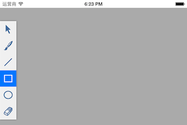

## 例3：绘图命令工具栏
-----------

1. 在StoryBoard中添加 GiCanvasView 视图，并在 ViewController 中创建关联变量 canvas_：

    ```
     @interface ViewController () {
         __weak IBOutlet GiCanvasView *canvas_;
     }
     @end
    ```

2. 添加按钮图片资源，设置命令工具栏：

    ```
    - (void)viewDidLoad {
        [super viewDidLoad];
    
        canvas_.tools = @[ @{@"image" : @"select.png", @"name" : @"select"},
                       @{@"image" : @"brush.png", @"name" : @"splines"},
                       @{@"image" : @"line.png", @"name" : @"line"},
                       @{@"image" : @"rect.png", @"name" : @"rect"},
                       @{@"image" : @"ellipse.png", @"name" : @"ellipse"},
                       @{@"image" : @"eraser.png", @"name" : @"erase"}];
        }
    ```

3. 在 Podfile 中引入 TouchVG，在命令行输入 `pod install` 或 `pod update --no-repo-update`
4. 运行测试绘图效果，检查上面的命令名是否正确。


