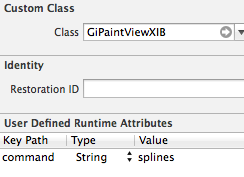
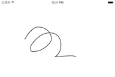
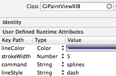
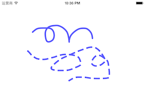

## 例1：使用StoryBoard绘图

> 本例介绍在StoryBoard中使用TouchVG的方法，可以不写绘图代码。

1. 使用 Single View Wizard 等向导创建工程

2. 在 Podfile 文件中导入TouchVG：

        platform :ios, '6.0'
        pod 'TouchVG'

   然后运行`pod install`下载TouchVG代码。后续可运行 `pod update --no-repo-update` 加快下载速度，不用每次检查最新版本。

   然后打开 *.xcworkspace 进入 Xcode。

3. 将 `ViewController.m`改为`ViewController.mm`。TouchVG是用C++实现的，在程序工程中至少有一个文件是.mm后缀名，否则会出现链接错误。

4. 打开 Main.storyboard ，拖动一个新 View 到主视图上，设置此新视图的Class为`GiPaintViewXIB`，添加值为`splines`的串属性`command`，如下左图所示。该属性可自动启动随手画曲线命令，运行后的手绘效果如下右图所示。

    

   可以设置更多属性，得到如下的手绘效果。利用属性可以在界面设计阶段指定绘图效果，而不用写相应的绘图代码。可用的绘图属性见 [GiPaintViewXIB.h](https://github.com/touchvg/vgios/blob/develop/include/GiPaintViewXIB.h)。`command`属性用于设置绘图命令。

     
